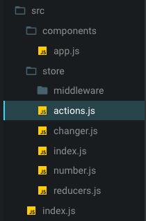
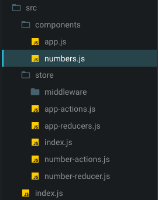

 LAB-31
=================================================

## Application State

### Author: Vanessa

### Links and Resources
* [repo](https://github.com/401-advanced-javascript-v/lab-31)
* [Connect to a store](https://codesandbox.io/s/kx9zoww89o)
* [Create a new reducer](https://codesandbox.io/s/8plj0vkzj2)

### Setup
#### `.env` requirements
* `npm i` install dependencies

#### Running the app
* `npm start`

### Components
#### Connect to a sotre

#### Create a new reducer

#### UML

